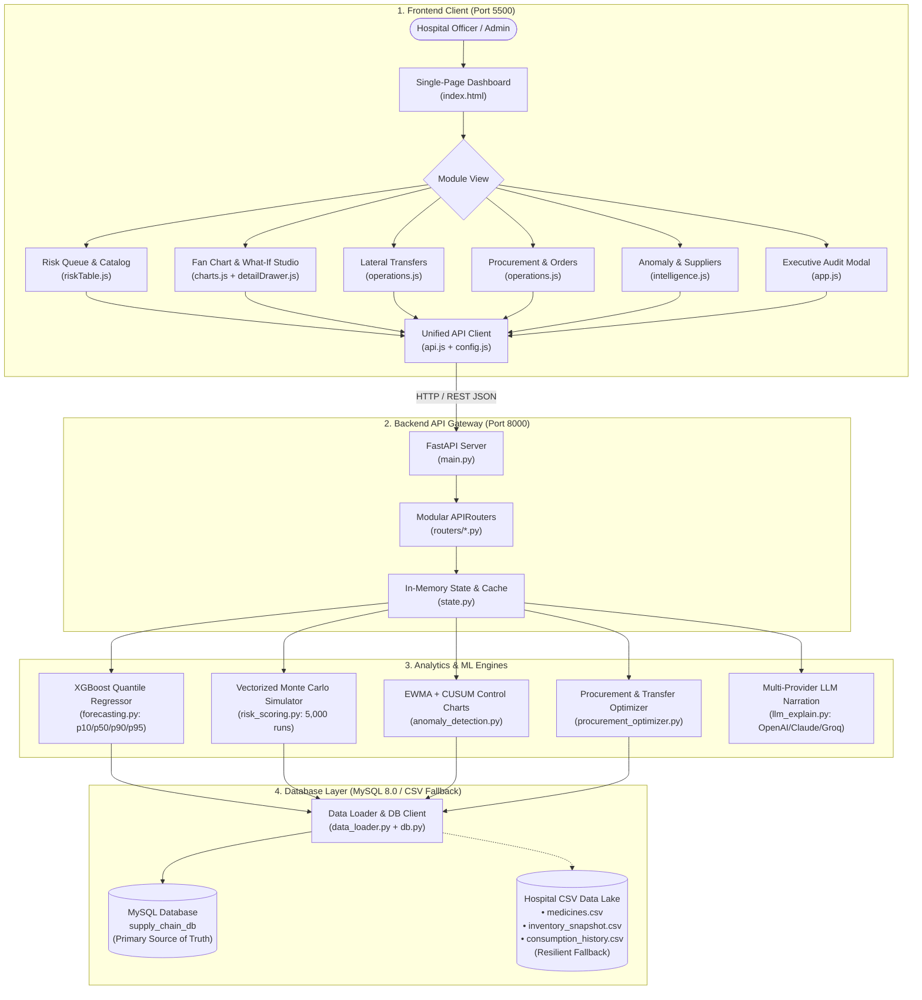

# Supply Watch 2.0 PRO — Healthcare Supply Chain Intelligence (Frontend Core)

> **Initial Release — Phase 1: Frontend Client**  
> Enterprise-grade clinical decision-support interface for hospital pharmacy networks, featuring probabilistic demand fan charts, live what-if surge simulations, lateral transfer dispatching, and automated procurement workflows.

---

## 1. Release Overview & Staged Rollout Strategy

This repository is published in staged phases to isolate concerns, maintain auditability, and ensure clean version control. **Phase 1 delivers the complete, self-contained Frontend Client.**

```
┌─────────────────────────────────────────────────────────────────────────┐
│                    STAGED REPOSITORY ROLLOUT PLAN                       │
├───────────────────┬─────────────────────────┬───────────────────────────┤
│ PHASE 1 [ACTIVE]  │ PHASE 2 [NEXT COMMIT]   │ PHASE 3 [FINAL COMMIT]    │
│ Frontend Client   │ FastAPI Backend         │ Healthcare Dataset Engine │
│ • Complete UI/UX  │ • Modular APIRouters    │ • Synthetic CSV Generator │
│ • Chart.js Engine │ • XGBoost Quantile Reg. │ • 104 SKUs, 3 Facilities  │
│ • State & Modals  │ • Multi-Provider LLMs   │ • Outbreak & Delay Events │
└───────────────────┴─────────────────────────┴───────────────────────────┘
```

The frontend is architected to operate with **zero build steps** (no Webpack, Vite, or `node_modules` dependencies required), rendering instantly in any modern browser while delivering high-density, control-room-grade visual ergonomics.

---

## 2. End-to-End Architecture Flow

```
┌──────────────────────────────────────────────────────────────────────────────────────────────────┐
│                                 1. CLIENT PRESENTATION TIER                                     │
│                                                                                                  │
│   ┌──────────────────────────────────────────────────────────────────────────────────────────┐   │
│   │                         Hospital Procurement Officer / Admin                             │   │
│   └─────────────────────────────────────────────┬────────────────────────────────────────────┘   │
│                                                 ▼                                                │
│   ┌─────────────────────────── Single-Page Application (index.html) ─────────────────────────┐   │
│   │                                                                                          │   │
│   │  [Header KPI Bar]         [Risk Priority Queue]        [SKU Detail Drawer & Fan Chart]   │   │
│   │  • Critical SKU counts    • Composite risk ranking     • Chart.js Quantile Fan Chart     │   │
│   │  • Overdue units alerts   • Branch & category filters  • 80% CI & p95 Hazard Limits      │   │
│   │  • Expiry loss value      • Real-time text search      • What-If Surge Demand Sliders    │   │
│   │                           • FEFO stock indicators      • AI Clinical Risk Rationale      │   │
│   │                                                                                          │   │
│   │  [Lateral Transfers Tab]  [Procurement POs Tab]        [Intelligence & Compliance Tab]   │   │
│   │  • Surplus re-balancing   • Budget-constrained recs    • Supplier delivery scorecards    │   │
│   │  • 1-Click dispatch       • Batch PO generator         • EWMA/CUSUM anomaly flags        │   │
│   │  • Transfer audit ledger  • CSV export                 • Executive compliance modal      │   │
│   └─────────────────────────────────────────────┬────────────────────────────────────────────┘   │
│                                                 ▼                                                │
│   ┌──────────────────────────── Modular Application Logic (ES6) ─────────────────────────────┐   │
│   │  app.js (Lifecycle Router)  ◄──►  ui.js (Toasts & Cards)   ◄──►  charts.js (Fan Chart)   │   │
│   │  riskTable.js (Catalog)     ◄──►  detailDrawer.js (Surge)  ◄──►  operations.js (PO/Xfer) │   │
│   │  intelligence.js (Sentinel) ◄──►  config.js (State/URL)    ◄──►  api.js (Fetch Client)   │   │
│   └─────────────────────────────────────────────┬────────────────────────────────────────────┘   │
└─────────────────────────────────────────────────┼────────────────────────────────────────────────┘
                                                  │ HTTP JSON (REST API)
                                                  │ Port 8000
┌─────────────────────────────────────────────────┼────────────────────────────────────────────────┐
│                                                 ▼                                                │
│                                 2. BACKEND API & ROUTING GATEWAY                                 │
│                                                                                                  │
│   ┌─────────────────────────── FastAPI Application (main.py) ────────────────────────────────┐   │
│   │  CORS Middleware  •  Pydantic V2 Request Schemas  •  In-Memory State & Cache (state.py)  │   │
│   └───────┬──────────────┬──────────────┬──────────────┬──────────────┬──────────────┬───────┘   │
│           │              │              │              │              │              │           │
│           ▼              ▼              ▼              ▼              ▼              ▼           │
│      /dashboard     /inventory     /procurement    /transfers    /simulations      /audit        │
│      /categories    /anomalies     /history        /dispatch     /network          /explain      │
└───────────┼──────────────┼──────────────┼──────────────┼──────────────┼──────────────┼───────────┘
            │              │              │              │              │              │
┌───────────┼──────────────┼──────────────┼──────────────┼──────────────┼──────────────┼───────────┐
│           ▼              ▼              ▼              ▼              ▼              ▼           │
│                               3. INTELLIGENCE & ANALYTIC ENGINES                                 │
│                                                                                                  │
│   ┌──────────────────────────────┐  ┌──────────────────────────────┐  ┌──────────────────────┐   │
│   │   forecasting.py             │  │   risk_scoring.py            │  │ anomaly_detection.py │   │
│   │   • XGBoost Quantile Reg.    │  │   • Monte Carlo Stockout     │  │ • Control Chart EWMA │   │
│   │   • p10, p50, p90, p95       │  │     Vectorized 5,000 runs    │  │ • CUSUM Drift Test   │   │
│   │   • Non-crossing pinball     │  │   • FEFO Expiry Projection   │  │ • Ground-truth recall│   │
│   │   • In-memory forecast cache │  │   • Criticality Weighting    │  │   validation (80%)   │   │
│   └──────────────┬───────────────┘  └──────────────┬───────────────┘  └──────────┬───────────┘   │
│                  │                                 │                             │               │
│                  ▼                                 ▼                             ▼               │
│   ┌──────────────────────────────┐  ┌──────────────────────────────┐  ┌──────────────────────┐   │
│   │   procurement_optimizer.py   │  │   llm_explain.py             │  │ data_loader.py       │   │
│   │   • Greedy budget allocator  │  │   • Multi-Provider Gateway   │  │ • Pandas In-Memory   │   │
│   │   • Lateral transfer finder  │  │   • OpenAI / Claude / Groq   │  │ • Clean Schema Store │   │
│   │   • Emergency reserve floors │  │   • Auditable Rule Fallback  │  │ • Easy DB swap-in    │   │
│   └──────────────────────────────┘  └──────────────────────────────┘  └──────────┬───────────┘   │
└──────────────────────────────────────────────────────────────────────────────────┼───────────────┘
                                                                                   │
┌──────────────────────────────────────────────────────────────────────────────────┼───────────────┐
│                                                                                  ▼               │
│                            4. RELATIONAL DATABASE & DATA LAKE (MySQL 8.0 / CSV)                  │
│                                                                                                  │
│   [MySQL: supply_chain_db]                   [Standalone SQL Dump & CSV Flat Lake]               │
│   • branches            • suppliers          • data/schema.sql (DDL + Indexes)                   │
│   • medicines           • consumption_hist   • data/supply_chain.sql (Full Data Dump)            │
│   • inventory_snapshot  • procurement_hist   • data/*.csv (Seed Data Lake & Resilient Fallback)  │
│   • supply_events       • usage_anomalies    • scripts/migrate_to_mysql.py (Auto-Migrator)       │
│   • dispatched_transfers (Audit Ledger)                                                          │
└──────────────────────────────────────────────────────────────────────────────────────────────────┘
```

### Interactive Mermaid Flow Diagram



---

## 3. Full Frontend Tech Stack

| Technology Layer | Tool / Library | Implementation Rationale & Architectural Purpose |
| :--- | :--- | :--- |
| **Markup & Semantics** | **HTML5 Semantic Elements** | Accessible structure utilizing `<header>`, `<main>`, `<nav>`, `<section>`, `<dialog>`, and custom data attributes (`data-idx`, `data-tab`) for robust DOM traversal. |
| **Styling & Theme** | **Vanilla CSS3 + Custom Properties** | Structured design system powered by CSS variables (`--bg`, `--cyan`, `--critical`, `--panel`), glassmorphism, flexbox/grid layouts, and responsive micro-animations. |
| **Application Logic** | **Modular Vanilla JavaScript (ES6+)** | Decoupled functional modules handling reactive state management, asynchronous API communications, DOM reconciliation, and client-side calculations. |
| **Data Visualization** | **Chart.js 4.4+ (Bundled Local UMD)** | High-performance canvas charting engine bundled locally at `frontend/js/chart.umd.min.js`. Configured for dual-layer fan charts, 80% confidence interval shading ($p_{10}-p_{90}$), median trajectory ($p_{50}$), and extreme tail hazard limits ($p_{95}$). |
| **Typography** | **Google Fonts (Inter & JetBrains Mono)** | `Inter` for high-legibility clinical typography paired with `JetBrains Mono` for tabular numerals, SKU IDs, dates, and currency values. |
| **Vector Graphics** | **Inline SVG Icons** | Zero external font-icon dependencies; lightweight, high-DPI inline vector paths for alerts, badges, navigation buttons, and status indicators. |

---

## 4. Frontend Architecture & Modular Organization

The frontend codebase is decoupled into dedicated style and script modules to avoid monolithic scripts:

```
frontend/
├── index.html                    ← Master dashboard SPA layout & tab containers
│
├── css/                          ← Modular Design System
│   ├── styles.css                ← Master aggregator importing all style sheets
│   ├── variables.css             ← Color palette, risk tokens, typography, and elevations
│   ├── base.css                  ← Reset rules, global scrollbars, typography, and utility classes
│   ├── components.css            ← KPI cards, tables, badges, tabs, buttons, modals, & toast popups
│   └── detail-drawer.css         ← SKU intelligence side panel, fan chart canvas, & what-if studio
│
└── js/                           ← Decoupled Application Architecture
    ├── chart.umd.min.js          ← Standalone Chart.js library (local fallback, zero CDN failure risk)
    ├── config.js                 ← Global API base URL and shared client application state
    ├── api.js                    ← Unified fetch wrapper with error handling & network timeout guards
    ├── charts.js                 ← Probabilistic fan chart renderer (Quantile bounds & interactive filter pills)
    ├── app.js                    ← Application bootstrap, tab switching router, search, & modal handlers
    │
    └── modules/                  ← Domain-Specific Feature Modules
        ├── ui.js                 ← Toast alerts, KPI cards, and header badge re-renders
        ├── riskTable.js          ← Risk Priority Queue table, sorting, branch/category filter chips
        ├── detailDrawer.js       ← SKU detail inspector, what-if surge sliders, and AI narrative loader
        ├── operations.js         ← Inter-facility transfer dispatcher and purchase order batch generator
        └── intelligence.js       ← Supplier scorecard matrix, macro stress-tester, & anomaly validation
```

---

## 5. Key UI Capabilities & Features

### 1. Risk Priority Queue (`riskTable.js`)
- Displays all hospital network medicines ranked by composite risk score ($0-100$).
- Color-coded risk tier badges: **Critical** ($\ge 70$), **High** ($45-69$), **Moderate** ($25-44$), and **Low** ($<25$).
- Instant client-side text filtering across medicine names, categories, and SKU codes.
- Facility selector (`All Branches`, `BR01 Central`, `BR02 North Wing`, `BR03 Emergency Hub`) and therapeutic category pills.

### 2. Probabilistic Demand Fan Chart (`charts.js`)
- Renders historical consumption side-by-side with multi-quantile forecast distributions:
  - **Expected Median ($p_{50}$)**: Solid cyan central line.
  - **80% Confidence Interval ($p_{10}-p_{90}$)**: Semi-transparent shaded envelope.
  - **95th Percentile Extreme Tail ($p_{95}$)**: Dashed red hazard limit for emergency reserve stress-testing.
- Interactive filter pills (`All Layers`, `80% Confidence`, `Median Expected`, `p95 Hazard Limit`) enabling users to toggle individual forecast envelopes.

### 3. SKU Intelligence Drawer & What-If Surge Studio (`detailDrawer.js`)
- Slides out on row selection to reveal detailed metrics: Days of Cover, Supplier Reliability, Mean Lead Time, and Overdue Pipeline Units.
- **What-If Scenario Simulator**: Interactive sliders for *Surge Demand Multiplier* ($1.0\times - 4.0\times$) and *Supplier Delay* ($+0\text{d} - +20\text{d}$) with immediate Monte Carlo re-calculation.
- **Clinical Supply Chain Rationale**: Plain-English justification for hospital procurement officers with zero-crash auditable fallback.

### 4. Operational Dispatch Panels (`operations.js`)
- **Lateral Transfer Rebalancing**: Surfaces opportunities to move surplus stock about to expire from one facility to another facing stockout risk. One-click dispatch updates transfer audit logs live.
- **Purchase Order (PO) Batch Creator**: Computes budget-constrained reorders, allows individual or batch PO dispatching, and supports instant CSV export.

### 5. Anomaly Sentinel & Supplier Scorecard (`intelligence.js`)
- **Control-Chart Anomaly Engine**: Shows EWMA and CUSUM consumption drift flags evaluated against labeled ground truth.
- **Supplier Intelligence Matrix**: Visualizes vendor on-time delivery percentages, average delay days, and stuck pipeline inventory.
- **Macro Stress Tester**: Quick-test presets (e.g. *Epidemic Surge*, *Regional Port Disruption*) to measure network-wide impact.

### 6. Executive Compliance & Audit Modal (`app.js`)
- Accessible via the header *Audit Report* button.
- Generates a clinical supply chain compliance summary, overall system health score, critical SKU inventory valuation, and total projected expiry waste value.

---

## 6. Backend REST API Contract Expectations

The frontend expects a backend serving JSON endpoints at `http://127.0.0.1:8000` (configurable via `frontend/js/config.js`):

| Endpoint | Method | Expected Return Payload Summary |
| :--- | :--- | :--- |
| `/api/dashboard/summary` | `GET` | Top-line network metrics (total SKUs, critical items, system health score). |
| `/api/branches` | `GET` | Array of facility branches (`branch_id`, `name`). |
| `/api/categories` | `GET` | Array of medicine therapeutic categories. |
| `/api/medicines` | `GET` | List of SKU risk items with pagination, filters, and sort params. |
| `/api/medicines/{id}` | `GET` | Detailed SKU record with historical sales, XGBoost forecast quantiles, and recent anomalies. |
| `/api/simulate` | `POST` | Single-SKU Monte Carlo simulation under surge demand/delay inputs. |
| `/api/simulate/network` | `POST` | Systemic stress test simulation across all facilities. |
| `/api/transfers` | `GET` | Recommended lateral facility stock transfers. |
| `/api/transfers/dispatch`| `POST` | Dispatches an inter-facility transfer and records audit entry. |
| `/api/transfers/history` | `GET` | History of all dispatched lateral transfers. |
| `/api/procurement/recommendations` | `GET` | Recommended purchase orders within specified budget. |
| `/api/procurement/order`| `POST` | Creates and logs a verified Purchase Order. |
| `/api/procurement/history` | `GET` | Audit log of all issued purchase orders. |
| `/api/suppliers/intelligence` | `GET` | Supplier scorecards with on-time delivery percentages. |
| `/api/anomalies/validate` | `GET` | Detector recall statistics against labeled ground-truth events. |
| `/api/audit/summary` | `GET` | Executive audit metrics and compliance health report. |
| `/api/explain` | `POST` | Generates plain-English clinical risk rationale. |
| `/api/refresh` | `POST` | Triggers cache recomputation across the inventory matrix. |

---

## 7. How to Run & Preview the Frontend Locally

Because the frontend requires no compilation or package installation, you can launch it using any lightweight static web server:

### Option A: Using Python (Recommended)
```bash
# From the repository root
python -m http.server 5500 --directory frontend
```
Then open your browser and navigate to:
```
http://127.0.0.1:5500/
```

### Option B: Using Node.js `serve` / `npx`
```bash
npx serve frontend -p 5500
```

### Option C: VS Code Live Server
Right-click `frontend/index.html` inside VS Code and select **"Open with Live Server"**.

---

---

## 8. MySQL Database Setup & Migration

The system operates with a dedicated MySQL 8.0 relational database (`supply_chain_db`) for transactional persistence and query performance.

### Database Architecture & Tables
- **`branches`**: Hospital locations and facility types (BR01, BR02, BR03).
- **`suppliers`**: Vendor profiles, lead-time distribution parameters, and reliability ratings.
- **`medicines`**: SKU master catalogue with clinical criticality tiers, reorder thresholds, and unit costs.
- **`consumption_history`**: Daily consumption records across branches indexed by date and medicine SKU.
- **`inventory_snapshot`**: Stock levels, earmarked procedure reserves, emergency floor reserves, and batch expiration dates.
- **`procurement_history`**: Historical and live purchase orders, delivery dates, and fulfillment statuses.
- **`supply_events`**: Macro demand surges, outbreak patterns, and supplier disruption events.
- **`usage_anomalies`**: Ground-truth anomaly labels used to validate the EWMA/CUSUM detector.
- **`dispatched_transfers`**: Audit ledger tracking live inter-facility lateral transfers in transit.

### Configuration (`backend/.env`)
Configure your MySQL connection parameters in `backend/.env`:
```env
USE_MYSQL=true
MYSQL_HOST=localhost
MYSQL_PORT=3306
MYSQL_USER=root
MYSQL_PASSWORD=root
MYSQL_DATABASE=supply_chain_db
```

### Running the Migration & Seed Script
To create the database, execute DDL schema definitions, and ingest all data:
```bash
python scripts/migrate_to_mysql.py
```
This also outputs a complete, standalone SQL dump file:
- [`data/schema.sql`](file:///c:/Users/logeshwaran/OneDrive/Documents/supply-chain-intelligence/supply-chain/data/schema.sql) — Clean DDL definitions with foreign keys and index constraints.
- [`data/supply_chain.sql`](file:///c:/Users/logeshwaran/OneDrive/Documents/supply-chain-intelligence/supply-chain/data/supply_chain.sql) — Full SQL dump ready for direct CLI or GUI import (`mysql -u root -p < data/supply_chain.sql`).

### Resilient Fallback Mode
If MySQL is offline or disabled (`USE_MYSQL=false`), the backend's resilient data loader (`data_loader.py`) automatically falls back to local CSV files without interrupting API operations.

---

## 9. Connecting to the Backend (Phase 2 Preview)

Once the backend is added in the next phase, start the FastAPI service:
```bash
cd backend
python -m uvicorn main:app --host 127.0.0.1 --port 8000
```
The frontend automatically points to `http://127.0.0.1:8000` by default. To point to an alternate backend host or cloud deployment, edit `API_BASE` in [`frontend/js/config.js`](file:///c:/Users/Hi/supply-chain-intelligence/supply-chain/frontend/js/config.js):

```javascript
// frontend/js/config.js
const CONFIG = {
  API_BASE: "http://127.0.0.1:8000", // Change if deploying backend remotely
  DEFAULT_BRANCH: "ALL",
  DEFAULT_SORT: "composite_risk_score"
};
```

---

## 10. License & Acknowledgments

- **Domain**: AI in Healthcare & Supply Chain Resilience
- **Design System**: Tailored dark-mode control room aesthetic inspired by clinical telemetry monitors and mission-critical operations consoles.
- **Visualization**: Powered by Chart.js (MIT License).

