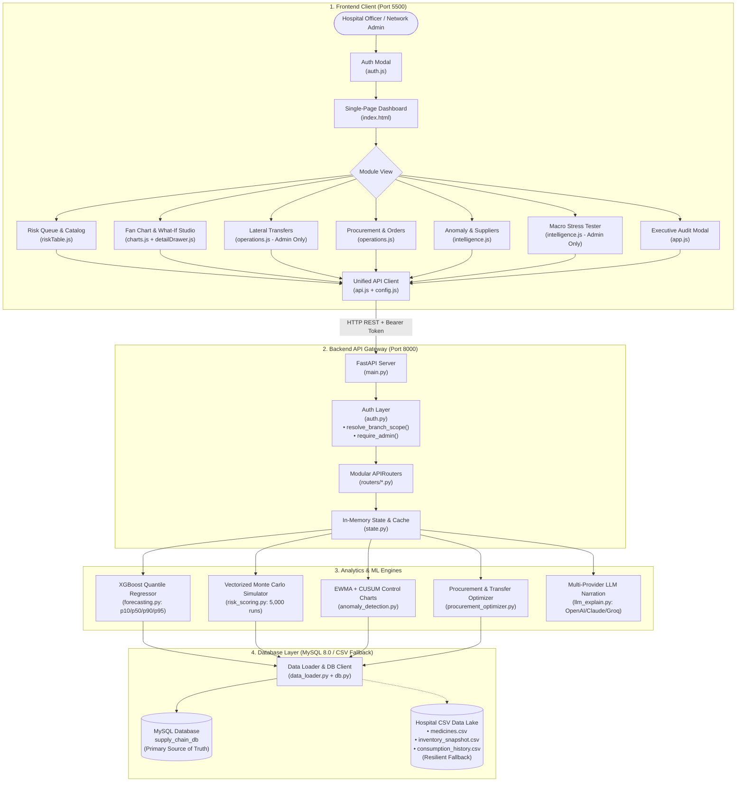

# MedStock IQ 2.0 PRO — Healthcare Supply Chain Intelligence

> **Enterprise-Grade Clinical Decision-Support & Resilient Inventory Optimization Platform**  
> Probabilistic demand fan charts, live what-if surge simulations, automated budget-constrained procurement, lateral transfer rebalancing, and server-enforced multi-facility role-based access control.

---

## 1. System Architecture & Flow

MedStock IQ 2.0 PRO is built as a cohesive, resilient four-tier system:

```
┌──────────────────────────────────────────────────────────────────────────────────────────────────┐
│                                 1. CLIENT PRESENTATION TIER                                     │
│                                                                                                  │
│   ┌──────────────────────────────────────────────────────────────────────────────────────────┐   │
│   │                    Hospital Procurement Officer / Clinical Admin                         │   │
│   └─────────────────────────────────────────────┬────────────────────────────────────────────┘   │
│                                                 ▼                                                │
│   ┌─────────────────────────── Single-Page Application (index.html) ─────────────────────────┐   │
│   │                                                                                          │   │
│   │  [Header KPI Bar]         [Risk Priority Queue]        [SKU Detail Drawer & Fan Chart]   │   │
│   │  • Critical SKU counts    • Composite risk ranking     • Chart.js Quantile Fan Chart     │   │
│   │  • Overdue units alerts   • Branch & category filters  • 80% CI & p95 Hazard Limits      │   │
│   │  • Expiry loss value      • Real-time text search      • What-If Surge Demand Sliders    │   │
│   │                           • FEFO stock indicators      • AI Clinical Risk Rationale      │   │
│   │                                                                                          │   │
│   │  [Lateral Transfers Tab]  [Procurement POs Tab]        [Intelligence & Compliance Tab]   │   │
│   │  • Surplus re-balancing   • Budget-constrained recs    • Supplier delivery scorecards    │   │
│   │  • 1-Click dispatch       • Batch PO generator         • EWMA/CUSUM anomaly flags        │   │
│   │  • Transfer audit ledger  • CSV export                 • Executive compliance modal      │   │
│   │                                                                                          │   │
│   │  [User Session Pill]      [Interactive Login Modal]                                      │   │
│   │  • Facility context       • Role-based interface                                         │   │
│   └─────────────────────────────────────────────┬────────────────────────────────────────────┘   │
│                                                 ▼                                                │
│   ┌──────────────────────────── Modular Application Logic (ES6) ─────────────────────────────┐   │
│   │  auth.js (Login & Roles)   ◄──►  ui.js (Toasts & Cards)   ◄──►  charts.js (Fan Chart)    │   │
│   │  riskTable.js (Catalog)    ◄──►  detailDrawer.js (Surge)  ◄──►  operations.js (PO/Xfer)  │   │
│   │  intelligence.js (Sentinel)◄──►  config.js (State/URL)    ◄──►  api.js (Fetch Client)    │   │
│   └─────────────────────────────────────────────┬────────────────────────────────────────────┘   │
│                                                 │ HTTP JSON (REST API) + Bearer Token            │
│                                                 │ Port 8000                                      │
├─────────────────────────────────────────────────┼────────────────────────────────────────────────┤
│                                                 ▼                                                │
│                                 2. BACKEND API & ROUTING GATEWAY                                 │
│                                                                                                  │
│   ┌─────────────────────────── FastAPI Application (main.py) ────────────────────────────────┐   │
│   │  CORS Middleware  •  In-Memory Token Auth  •  Pydantic Schemas  •  Scoped Cache (state.py)│   │
│   └───────┬──────────────┬──────────────┬──────────────┬──────────────┬──────────────┬───────┘   │
│           │              │              │              │              │              │           │
│           ▼              ▼              ▼              ▼              ▼              ▼           │
│         /auth       /dashboard     /inventory     /procurement    /transfers    /simulations     │
│         /me         /categories    /anomalies     /suppliers      /dispatch     /audit /explain  │
│                                                                                                  │
│   [Server-Side Isolation Layer]                                                                  │
│   • resolve_branch_scope(): Branch users strictly locked to their assigned hospital facility     │
│   • require_admin(): Blocks branch users from cross-facility transfers and macro stress-testing │
├──────────────────────────────────────────────────────────────────────────────────────────────────┤
│                               3. INTELLIGENCE & ANALYTIC ENGINES                                 │
│                                                                                                  │
│   ┌──────────────────────────────┐  ┌──────────────────────────────┐  ┌──────────────────────┐   │
│   │   forecasting.py             │  │   risk_scoring.py            │  │ anomaly_detection.py │   │
│   │   • XGBoost Quantile Reg.    │  │   • Monte Carlo Stockout     │  │ • Control Chart EWMA │   │
│   │   • p10, p50, p90, p95       │  │     Vectorized 5,000 runs    │  │ • CUSUM Drift Test   │   │
│   │   • Non-crossing pinball     │  │   • FEFO Expiry Projection   │  │ • Ground-truth recall│   │
│   │   • In-memory forecast cache │  │   • Criticality Weighting    │  │   validation (80%)   │   │
│   └──────────────┬───────────────┘  └──────────────┬───────────────┘  └──────────┬───────────┘   │
│                  │                                 │                             │               │
│                  ▼                                 ▼                             ▼               │
│   ┌──────────────────────────────┐  ┌──────────────────────────────┐  ┌──────────────────────┐   │
│   │   procurement_optimizer.py   │  │   llm_explain.py             │  │ data_loader.py       │   │
│   │   • Greedy budget allocator  │  │   • Multi-Provider Gateway   │  │ • Pandas In-Memory   │   │
│   │   • Lateral transfer finder  │  │   • OpenAI / Claude / Groq   │  │ • Clean Schema Store │   │
│   │   • Emergency reserve floors │  │   • Auditable Rule Fallback  │  │ • Fast O(1) Indexing │   │
│   └──────────────────────────────┘  └──────────────────────────────┘  └──────────┬───────────┘   │
├──────────────────────────────────────────────────────────────────────────────────┼───────────────┤
│                                                                                  ▼               │
│                            4. RELATIONAL DATABASE & DATA LAKE (MySQL 8.0 / CSV)                  │
│                                                                                                  │
│   [MySQL: supply_chain_db]                   [Standalone SQL Dump & CSV Flat Lake]               │
│   • branches            • suppliers          • data/schema.sql (DDL + Indexes)                   │
│   • medicines           • consumption_hist   • data/supply_chain.sql (Full Data Dump)            │
│   • inventory_snapshot  • procurement_hist   • data/*.csv (Seed Data Lake & Resilient Fallback)  │
│   • supply_events       • usage_anomalies    • scripts/migrate_to_mysql.py (Auto-Migrator)       │
│   • dispatched_transfers (Audit Ledger)                                                          │
└──────────────────────────────────────────────────────────────────────────────────────────────────┘
```

### Interactive Architecture Flow



---

## 2. Complete Project File & Directory Structure

```
supply-chain/
├── backend/                              # FastAPI REST API & Analytical Modeling Server
│   ├── routers/                          # Modular APIRouters (Endpoint Handlers)
│   │   ├── __init__.py                   # Package exports
│   │   ├── anomalies.py                  # Anomaly detection & ground-truth validation endpoints
│   │   ├── audit.py                      # Executive compliance & system health audit routes
│   │   ├── auth.py                       # User login & current identity (/api/login, /api/me)
│   │   ├── dashboard.py                  # Executive KPI summary, branches, and categories
│   │   ├── inventory.py                  # Medicine catalog, SKU details, & demand forecasting
│   │   ├── procurement.py                # Budget-constrained orders & PO generation
│   │   ├── simulations.py                # What-if surge simulations & macro network stress tests
│   │   ├── suppliers.py                  # Supplier reliability scorecards & delay analytics
│   │   └── transfers.py                  # Inter-facility lateral transfer recommendations & dispatch
│   ├── .env                              # MySQL credentials & OpenAI/LLM API keys
│   ├── anomaly_detection.py              # EWMA control charts & CUSUM drift detection engine
│   ├── auth.py                           # User credentials dictionary, token auth, & branch scoping
│   ├── data_loader.py                    # MySQL loader with CSV fallback & O(1) indexed accessors
│   ├── db.py                             # SQLAlchemy connection pooling & MySQL persistence layer
│   ├── forecasting.py                    # XGBoost Quantile Regressor (p10, p50, p90, p95)
│   ├── llm_explain.py                    # Multi-provider clinical rationale generator (OpenAI/Claude/Groq)
│   ├── main.py                           # Application entrypoint & CORS middleware configuration
│   ├── procurement_optimizer.py          # Greedy budget allocator & lateral transfer finder
│   ├── risk_scoring.py                   # 5,000-run Monte Carlo simulation & FEFO expiry waste model
│   ├── schemas.py                        # Pydantic request & response models
│   └── state.py                          # In-memory cached risk scores & cache TTL invalidation
│
├── data/                                 # Relational Database Seed Data & CSV Flat Data Lake
│   ├── branches.csv                      # 3 hospital facilities (BR01 City General, BR02, BR03)
│   ├── consumption_history.csv           # 3.1 MB time-series daily usage history (113,880 records)
│   ├── data_dictionary.csv               # Data dictionary with column types and definitions
│   ├── generate_data.py                  # Deterministic synthetic healthcare dataset generator
│   ├── inventory_snapshot.csv            # 312 facility-SKU nodes, stock levels, batch expirations
│   ├── medicines.csv                     # 104 clinical SKU master records & policy thresholds
│   ├── procurement_history.csv           # Historical purchase orders, lead times, delivery statuses
│   ├── schema.sql                        # Clean MySQL DDL definitions with foreign keys and indexes
│   ├── suppliers.csv                     # 15 pharmaceutical vendor profiles & performance metrics
│   ├── supply_chain.sql                  # Complete 5.0 MB standalone MySQL database dump
│   ├── supply_events.csv                 # Macro event logs (disease outbreaks, port delay shocks)
│   └── usage_anomalies.csv               # 762 ground-truth labeled consumption spikes & drift flags
│
├── frontend/                             # Zero-Build SPA Interface (HTML5 / ES6 Vanilla JS / CSS3)
│   ├── css/                              # Modular Telemetry Dark-Mode Design System
│   │   ├── base.css                      # Global resets, typography, and utility layout classes
│   │   ├── components.css                # KPI cards, data tables, buttons, tabs, login overlay
│   │   ├── detail-drawer.css             # Slide-out SKU drawer, what-if sliders, fan chart styling
│   │   ├── styles.css                    # Master stylesheet aggregator importing all modules
│   │   └── variables.css                 # CSS custom properties, risk tier palettes, typography tokens
│   ├── js/                               # Decoupled Application Architecture
│   │   ├── modules/                      # Domain-Specific Client Modules
│   │   │   ├── detailDrawer.js           # SKU drawer inspector, surge sliders, AI rationale
│   │   │   ├── intelligence.js           # Supplier scorecards, macro stress tester, anomaly validation
│   │   │   ├── operations.js             # Lateral transfer dispatching & purchase order creator
│   │   │   ├── riskTable.js              # Risk priority table, column sorting, category/facility filter chips
│   │   │   └── ui.js                     # Toast notifications, KPI badge counters, DOM helpers
│   │   ├── api.js                        # Unified fetch wrapper with Bearer token injection
│   │   ├── app.js                        # Lifecycle coordinator, keyboard shortcuts, modal handlers
│   │   ├── auth.js                       # Login form handler, localStorage session restore, RBAC restrictions
│   │   ├── chart.umd.min.js              # Standalone Chart.js 4.4+ engine (local bundle, zero CDN risk)
│   │   ├── charts.js                     # Multi-quantile fan chart renderer with layer toggle pills
│   │   └── config.js                     # Global state store and API_BASE URL configuration
│   ├── index.html                        # Single-Page Application root layout, modals, & templates
│   └── README.md                         # Frontend component documentation
│
├── scripts/                              # Automation, Migration & Startup Scripts
│   ├── migrate_to_mysql.py               # Auto-migration script: builds schema & ingests CSVs to MySQL
│   ├── run.ps1                           # Automated 1-click startup script for Windows PowerShell
│   └── run.sh                            # Automated 1-click startup script for Linux & macOS
│
├── requirements.txt                      # Python dependencies (FastAPI, Uvicorn, XGBoost, Pandas, etc.)
└── README.md                             # Comprehensive project documentation
```

---

## 3. Authentication & Role-Based Access Control (RBAC)

The application enforces **server-side multi-facility data isolation**. A facility account cannot read or modify data belonging to another hospital, regardless of client parameters.

### Default Demo Credentials

| Username | Password | Role | Assigned Facility | Permissions & Data Scope |
| :--- | :--- | :--- | :--- | :--- |
| **`admin`** | `admin123` | `admin` | **All Facilities (Network)** | • Full visibility across all 312 facility-SKU pairs.<br>• Access to **Lateral Transfers** rebalancing.<br>• Access to **Macro Network Stress-Tester**.<br>• Cross-facility audit report generation. |
| **`citygeneral`** | `demo123` | `branch` | **City General Hospital (`BR01`)** | • Scoped strictly to City General (`104 SKUs`).<br>• Facility dropdown permanently locked.<br>• Cross-branch tabs hidden in UI and rejected by API (`403 Forbidden`). |
| **`riverside`** | `demo123` | `branch` | **Riverside Community Hospital (`BR02`)** | • Scoped strictly to Riverside (`104 SKUs`).<br>• Isolated inventory, procurement, and risk metrics. |
| **`northdistrict`** | `demo123` | `branch` | **North District Clinic (`BR03`)** | • Scoped strictly to North District (`104 SKUs`).<br>• Isolated inventory, procurement, and risk metrics. |

### How Server-Side Security Works
1. **Header Verification**: Every data-bearing API endpoint depends on `get_current_user`, which validates the `Authorization: Bearer <token>` header against active sessions in memory.
2. **Mandatory Scope Resolution**: `resolve_branch_scope(user, requested_branch_id)` overrides any branch parameter sent in the URL or query string with `user["branch_id"]` for branch-level accounts.
3. **Privileged Endpoints**: Endpoints that operate cross-facility (such as `/api/transfers` or `/api/simulations/network`) use `require_admin` dependency and return `403 Forbidden` for any non-admin token.
4. **Session Persistence**: Sessions are saved in browser `localStorage` (`supplyWatchAuth`). On page load, `auth.js` verifies the token with `GET /api/me`. To log out, click the **User Badge** in the top-right header.

---

## 4. The Healthcare Dataset

The system manages a synthetic dataset representing a metropolitan hospital network:

* **104 Clinical SKUs** across 7 therapeutic categories (Emergency Drugs, Antibiotics, Oncology, Critical ICU, Cardiovascular, Anesthesia, Analgesics).
* **3 Hospital Facilities**:
  * `BR01`: **City General Hospital** (Level-1 Trauma Center / Main Campus)
  * `BR02`: **Riverside Community Hospital** (Suburban Satellite)
  * `BR03`: **North District Clinic** (Outpatient & Urgent Care Hub)
* **312 Facility-SKU Inventory Nodes** actively modeled.
* **113,880 Daily Consumption Records** spanning 3 years of daily usage history with seasonal surges, holiday dips, and outbreak spikes.
* **15 Certified Pharmaceutical Vendors** with lead-time distributions and reliability metrics.
* **762 Labeled Anomaly Events** to benchmark the EWMA / CUSUM detection sentinel.

### Data File Reference (`data/`)

| File | Type | Purpose |
| :--- | :--- | :--- |
| [`data/medicines.csv`](data/medicines.csv) | Master | SKU catalog, unit costs, reorder thresholds, max stock caps, shelf life days. |
| [`data/branches.csv`](data/branches.csv) | Master | Facility IDs, names, and operational tiers. |
| [`data/suppliers.csv`](data/suppliers.csv) | Master | Vendor lead-time averages, standard deviations, and reliability ratings. |
| [`data/inventory_snapshot.csv`](data/inventory_snapshot.csv) | State | Stock levels, reserved procedure units, emergency reserve floors, batch expiry dates. |
| [`data/consumption_history.csv`](data/consumption_history.csv) | Time-Series | 3.1 MB historical daily consumption for quantile forecasting. |
| [`data/procurement_history.csv`](data/procurement_history.csv) | Ledger | Purchase orders, lead times, delivery statuses (`DELIVERED`, `PENDING`). |
| [`data/usage_anomalies.csv`](data/usage_anomalies.csv) | Evaluation | Ground-truth consumption spikes and disruption labels for model scoring. |
| [`data/supply_events.csv`](data/supply_events.csv) | Events | Exogenous events (e.g. influenza epidemic, port transport strikes). |
| [`data/schema.sql`](data/schema.sql) | DDL | MySQL table schemas, indexes, and constraints. |
| [`data/supply_chain.sql`](data/supply_chain.sql) | Dump | Complete 5.0 MB MySQL dump ready for direct database import. |
| [`data/generate_data.py`](data/generate_data.py) | Generator | Python generator used to synthesize or regenerate the complete dataset. |

---

## 5. Machine Learning & Decision Engines

### 1. XGBoost Probabilistic Demand Forecasting (`forecasting.py`)
* Computes multi-quantile probabilistic demand trajectories:
  * **$p_{10}$**: Lower bound (pessimistic demand).
  * **$p_{50}$**: Expected median trajectory.
  * **$p_{90}$**: Upper 80% confidence interval bound.
  * **$p_{95}$**: Extreme tail hazard limit used for stress-testing hospital safety floors.
* Features non-crossing pinball loss stabilization and bootstrapped residual simulation.

### 2. Vectorized Monte Carlo Stockout Simulation (`risk_scoring.py`)
* Runs **5,000 randomized Monte Carlo iterations per node**:
  * Samples demand along the forecast distribution.
  * Samples supplier lead times from a log-normal distribution $\mathcal{N}(\mu_{\text{lead}}, \sigma_{\text{lead}})$.
* Yields true probability of stockout before the next replenishment arrives.

### 3. FEFO Expiry Waste Predictor (`risk_scoring.py`)
* First-Expired, First-Out (FEFO) clinical waste scoring: evaluates whether existing on-hand stock will clear based on expected daily consumption before the nearest batch expiry date.

### 4. Anomaly Sentinel (`anomaly_detection.py`)
* Dual-stage statistical process control:
  * **Lagged Baseline EWMA**: Detects sudden transient consumption surges.
  * **CUSUM (Cumulative Sum Control Chart)**: Detects subtle, sustained demand drift over multi-week intervals.
  * Evaluated against 762 ground-truth labeled historical events.

### 5. Procurement & Lateral Transfer Optimizer (`procurement_optimizer.py`)
* **Lateral Transfer Discovery**: Scans for inter-facility rebalancing opportunities where one hospital has stock nearing expiry while a neighboring hospital is experiencing high stockout probability.
* **Greedy Budget Allocator**: Knapsack-style replenishment prioritization constrained by capital limits, strictly guaranteeing emergency reserve minimums.

---

## 6. Quick Start (Local Development)

### Prerequisites
* Python 3.10, 3.11, or 3.12
* MySQL 8.0+ *(Optional: system automatically falls back to CSV if MySQL is disabled or offline)*
* Modern web browser (Chrome, Edge, Firefox, Safari)

### Option 1: Automated Script (Recommended)

#### Windows (PowerShell):
```powershell
.\scripts\run.ps1
```

#### Linux / macOS (Bash):
```bash
bash scripts/run.sh
```

The script will automatically:
1. Verify synthetic datasets in `data/`.
2. Synchronize and seed the MySQL database (`scripts/migrate_to_mysql.py`).
3. Start the FastAPI backend on `http://127.0.0.1:8000`.
4. Start the frontend static server on `http://127.0.0.1:5500`.

---

### Option 2: Manual Step-by-Step

#### Step 1: Install Dependencies
```bash
python -m venv venv
# Windows:
.\venv\Scripts\activate
# Linux/macOS:
source venv/bin/activate

pip install -r requirements.txt
pip install python-dotenv
```

#### Step 2: Configure Environment (`backend/.env`)
Create or edit `backend/.env`:
```ini
USE_MYSQL=true
MYSQL_HOST=localhost
MYSQL_PORT=3306
MYSQL_USER=root
MYSQL_PASSWORD=root
MYSQL_DATABASE=supply_chain_db

# Optional LLM Rationale Generation
OPENAI_API_KEY=your_key_here
```

#### Step 3: Seed MySQL Database
```bash
python scripts/migrate_to_mysql.py
```
*(If you do not have MySQL installed, set `USE_MYSQL=false` in `backend/.env` to run in resilient CSV mode).*

#### Step 4: Start Backend API
```bash
cd backend
python -m uvicorn main:app --host 127.0.0.1 --port 8000 --reload
```
Interactive OpenAPI documentation will be live at: [`http://127.0.0.1:8000/docs`](http://127.0.0.1:8000/docs)

#### Step 5: Start Frontend
In a new terminal:
```bash
cd frontend
python -m http.server 5500 --bind 127.0.0.1
```
Open [`http://127.0.0.1:5500`](http://127.0.0.1:5500) and log in with `admin` / `admin123`.

---

## 7. Complete Production Deployment Guide

### Option A: Linux Server with Nginx + Systemd (Ubuntu / Debian / EC2)

#### 1. Install System Packages
```bash
sudo apt update && sudo apt install -y python3 python3-pip python3-venv mysql-server nginx git certbot python3-certbot-nginx
```

#### 2. Configure MySQL Database
```sql
sudo mysql
CREATE DATABASE supply_chain_db DEFAULT CHARACTER SET utf8mb4 COLLATE utf8mb4_unicode_ci;
CREATE USER 'supply_user'@'localhost' IDENTIFIED BY 'StrongPassword123!';
GRANT ALL PRIVILEGES ON supply_chain_db.* TO 'supply_user'@'localhost';
FLUSH PRIVILEGES;
EXIT;
```

#### 3. Clone Repository & Setup Virtual Environment
```bash
sudo mkdir -p /var/www/supply-chain
sudo chown -R $USER:$USER /var/www/supply-chain
git clone <YOUR_REPO_URL> /var/www/supply-chain
cd /var/www/supply-chain

python3 -m venv venv
source venv/bin/activate
pip install -r requirements.txt python-dotenv gunicorn
```

#### 4. Configure & Seed
Update `/var/www/supply-chain/backend/.env` with your MySQL user credentials, then run:
```bash
python3 scripts/migrate_to_mysql.py
```

#### 5. Configure Frontend Endpoint
In `/var/www/supply-chain/frontend/js/config.js`, set `API_BASE` to empty string `""` so that requests use relative paths (`/api/...`) via the Nginx reverse proxy:
```javascript
const API_BASE = window.API_BASE || "";
```

#### 6. Setup Systemd Service
Create `/etc/systemd/system/supplychain.service`:
```ini
[Unit]
Description=Supply Chain Intelligence API
After=network.target mysql.service

[Service]
User=www-data
Group=www-data
WorkingDirectory=/var/www/supply-chain/backend
Environment="PATH=/var/www/supply-chain/venv/bin"
ExecStart=/var/www/supply-chain/venv/bin/gunicorn main:app \
    --workers 4 \
    --worker-class uvicorn.workers.UvicornWorker \
    --bind 127.0.0.1:8000
Restart=always

[Install]
WantedBy=multi-user.target
```

Enable and start:
```bash
sudo systemctl daemon-reload
sudo systemctl enable supplychain
sudo systemctl start supplychain
```

#### 7. Configure Nginx Reverse Proxy
Create `/etc/nginx/sites-available/supplychain`:
```nginx
server {
    listen 80;
    server_name yourdomain.com;

    root /var/www/supply-chain/frontend;
    index index.html;

    location / {
        try_files $uri $uri/ /index.html;
    }

    location /api/ {
        proxy_pass http://127.0.0.1:8000/api/;
        proxy_set_header Host $host;
        proxy_set_header X-Real-IP $remote_addr;
        proxy_set_header X-Forwarded-For $proxy_add_x_forwarded_for;
        proxy_set_header X-Forwarded-Proto $scheme;
    }

    location /docs {
        proxy_pass http://127.0.0.1:8000/docs;
        proxy_set_header Host $host;
    }

    location /openapi.json {
        proxy_pass http://127.0.0.1:8000/openapi.json;
        proxy_set_header Host $host;
    }
}
```

Enable site and activate HTTPS:
```bash
sudo ln -s /etc/nginx/sites-available/supplychain /etc/nginx/sites-enabled/
sudo nginx -t && sudo systemctl restart nginx
sudo certbot --nginx -d yourdomain.com
```

---

### Option B: Containerized Deployment (Docker & Docker Compose)

Create a `docker-compose.yml` in the project root:

```yaml
version: '3.8'

services:
  mysql:
    image: mysql:8.0
    container_name: supply_mysql
    environment:
      MYSQL_ROOT_PASSWORD: rootpassword
      MYSQL_DATABASE: supply_chain_db
      MYSQL_USER: supply_user
      MYSQL_PASSWORD: supplypassword
    volumes:
      - mysql_data:/var/lib/mysql
      - ./data/supply_chain.sql:/docker-entrypoint-initdb.d/init.sql
    restart: unless-stopped
    healthcheck:
      test: ["CMD", "mysqladmin", "ping", "-h", "localhost"]
      interval: 10s
      timeout: 5s
      retries: 5

  backend:
    build:
      context: .
      dockerfile: Dockerfile.backend
    container_name: supply_backend
    environment:
      USE_MYSQL: "true"
      MYSQL_HOST: mysql
      MYSQL_PORT: 3306
      MYSQL_USER: supply_user
      MYSQL_PASSWORD: supplypassword
      MYSQL_DATABASE: supply_chain_db
      OPENAI_API_KEY: ${OPENAI_API_KEY}
    depends_on:
      mysql:
        condition: service_healthy
    ports:
      - "8000:8000"
    restart: unless-stopped

  frontend:
    image: nginx:alpine
    container_name: supply_frontend
    ports:
      - "80:80"
    volumes:
      - ./frontend:/usr/share/nginx/html:ro
    restart: unless-stopped

volumes:
  mysql_data:
```

Launch with:
```bash
docker compose up -d --build
```

---

## 8. REST API Endpoints

All data-bearing endpoints require an `Authorization: Bearer <token>` header obtained from `/api/login`.

| Category | Method | Endpoint | Description | Scope / Access |
| :--- | :--- | :--- | :--- | :--- |
| **Auth** | `POST` | `/api/login` | Authenticate with username & password; returns bearer token and assigned facility. | Public |
| **Auth** | `GET` | `/api/me` | Retrieve profile and role metadata for active session token. | Authenticated |
| **Dashboard** | `GET` | `/api/dashboard/summary` | Top-line KPI metrics (monitored pairs, critical counts, total expiry valuation). | Scoped to Branch |
| **Metadata** | `GET` | `/api/branches` | List facility branches (filtered to assigned branch for branch users). | Scoped to Branch |
| **Metadata** | `GET` | `/api/categories` | Catalog of therapeutic medicine categories. | Authenticated |
| **Inventory** | `GET` | `/api/medicines` | Query catalog with risk tier, category, criticality filters, and sorting. | Scoped to Branch |
| **Inventory** | `GET` | `/api/medicines/{id}` | Detailed SKU records, consumption time series, and 21-day quantile forecast. | Scoped to Branch |
| **Simulation** | `POST` | `/api/simulate` | Interactive what-if surge multiplier and supplier delay Monte Carlo stress test. | Scoped to Branch |
| **Simulation** | `POST` | `/api/simulations/network` | Systemic shock stress test across all facilities (Epidemic Surge, Port Disruption). | **Admin Only** |
| **Transfers** | `GET` | `/api/transfers` | Lateral stock rebalancing recommendations between surplus & stockout facilities. | **Admin Only** |
| **Transfers** | `POST` | `/api/transfers/dispatch`| Dispatches a lateral transfer and updates real-time inventory and audit log. | **Admin Only** |
| **Transfers** | `GET` | `/api/transfers/history` | Audit log of all dispatched lateral transfers. | Authenticated |
| **Procurement**| `GET` | `/api/procurement/recommendations` | Budget-constrained purchase order recommendations. | Scoped to Branch |
| **Procurement**| `POST` | `/api/procurement/order` | Place and log verified purchase orders. | Scoped to Branch |
| **Procurement**| `GET` | `/api/procurement/history` | Audit ledger of dispatched purchase orders. | Scoped to Branch |
| **Intelligence**| `GET` | `/api/suppliers` | Vendor scorecards, lead-time variance, and on-time delivery percentages. | Authenticated |
| **Intelligence**| `GET` | `/api/anomalies/validate` | EWMA & CUSUM detector recall and precision against labeled ground truth. | Authenticated |
| **Audit** | `GET` | `/api/audit/summary` | Executive clinical supply chain compliance summary and risk ledger. | Scoped to Branch |
| **Audit** | `POST` | `/api/explain` | Multi-provider LLM clinical rationale generation (OpenAI / Claude / Groq). | Authenticated |

---

## 9. Troubleshooting & FAQ

#### Q: The dashboard displays 0 items / 0 monitored nodes after login.
> **A:** This occurs if MySQL contains duplicate records (e.g. from an older schema migration). Run:
> ```bash
> python scripts/migrate_to_mysql.py
> ```
> This cleans and re-indexes all 104 SKUs and 312 facility-SKU nodes. Restart the backend after migration.

#### Q: How do I switch users or log out?
> **A:** Click the **User Badge** located in the top-right header corner (displays your username and hospital name). This clears the stored token from `localStorage` and returns you to the login screen.

#### Q: "Session expired. Please log in again."
> **A:** Token mappings are maintained in server memory for security. If the FastAPI backend restarts, existing tokens are invalidated. Simply enter your credentials on the login screen to receive a new token.

#### Q: Where do I configure remote API endpoints?
> **A:** In [`frontend/js/config.js`](frontend/js/config.js), edit `API_BASE`:
> ```javascript
> const API_BASE = window.API_BASE || "https://your-api-domain.com";
> ```

---

## 10. License & Project Metadata

* **Domain**: Healthcare Logistics, Clinical Supply Chain Resilience, Decision Support Systems
* **Design Language**: High-density clinical telemetry console (dark-mode aesthetic)
* **Charting Engine**: Chart.js 4.4+ (UMD, MIT License)
* **ML Stack**: XGBoost Quantile Regressors, Vectorized NumPy Monte Carlo Simulator, SciPy Statistics
