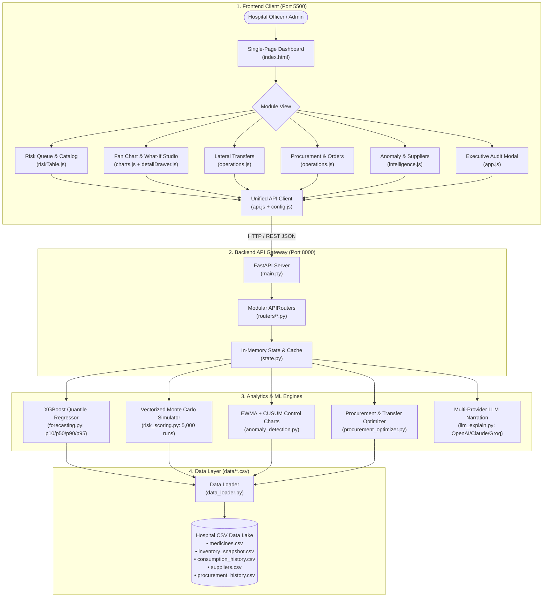

# Supply Watch 2.0 PRO — Healthcare Supply Chain Intelligence (Frontend Client)

Enterprise-grade clinical decision-support interface for hospital pharmacy networks, featuring probabilistic demand fan charts, live what-if surge simulations, lateral transfer dispatching, and automated procurement workflows.

---

## 1. End-to-End Architecture Flow

The diagram below illustrates the complete functional data and interaction flow from the user interface through the analytical services down to the storage layers:

```
┌──────────────────────────────────────────────────────────────────────────────────────────────────┐
│                                 1. CLIENT PRESENTATION TIER                                     │
│                                                                                                  │
│   ┌──────────────────────────────────────────────────────────────────────────────────────────┐   │
│   │                         Hospital Procurement Officer / Admin                             │   │
│   └─────────────────────────────────────────────┬────────────────────────────────────────────┘   │
│                                                 ▼                                                │
│   ┌─────────────────────────── Single-Page Application (index.html) ─────────────────────────┐   │
│   │                                                                                          │   │
│   │  [Header KPI Bar]         [Risk Priority Queue]        [SKU Detail Drawer & Fan Chart]   │   │
│   │  • Critical SKU counts    • Composite risk ranking     • Chart.js Quantile Fan Chart     │   │
│   │  • Overdue units alerts   • Branch & category filters  • 80% CI & p95 Hazard Limits      │   │
│   │  • Expiry loss value      • Real-time text search      • What-If Surge Demand Sliders    │   │
│   │                           • FEFO stock indicators      • AI Clinical Risk Rationale      │   │
│   │                                                                                          │   │
│   │  [Lateral Transfers Tab]  [Procurement POs Tab]        [Intelligence & Compliance Tab]   │   │
│   │  • Surplus re-balancing   • Budget-constrained recs    • Supplier delivery scorecards    │   │
│   │  • 1-Click dispatch       • Batch PO generator         • EWMA/CUSUM anomaly flags        │   │
│   │  • Transfer audit ledger  • CSV export                 • Executive compliance modal      │   │
│   └─────────────────────────────────────────────┬────────────────────────────────────────────┘   │
│                                                 ▼                                                │
│   ┌──────────────────────────── Modular Application Logic (ES6) ─────────────────────────────┐   │
│   │  app.js (Lifecycle Router)  ◄──►  ui.js (Toasts & Cards)   ◄──►  charts.js (Fan Chart)   │   │
│   │  riskTable.js (Catalog)     ◄──►  detailDrawer.js (Surge)  ◄──►  operations.js (PO/Xfer) │   │
│   │  intelligence.js (Sentinel) ◄──►  config.js (State/URL)    ◄──►  api.js (Fetch Client)   │   │
│   └─────────────────────────────────────────────┬────────────────────────────────────────────┘   │
└─────────────────────────────────────────────────┼────────────────────────────────────────────────┘
                                                  │ HTTP JSON (REST API)
                                                  │ Port 8000
┌─────────────────────────────────────────────────┼────────────────────────────────────────────────┐
│                                                 ▼                                                │
│                                 2. BACKEND API & ROUTING GATEWAY                                 │
│                                                                                                  │
│   ┌─────────────────────────── FastAPI Application (main.py) ────────────────────────────────┐   │
│   │  CORS Middleware  •  Pydantic V2 Request Schemas  •  In-Memory State & Cache (state.py)  │   │
│   └───────┬──────────────┬──────────────┬──────────────┬──────────────┬──────────────┬───────┘   │
│           │              │              │              │              │              │           │
│           ▼              ▼              ▼              ▼              ▼              ▼           │
│      /dashboard     /inventory     /procurement    /transfers    /simulations      /audit        │
│      /categories    /anomalies     /history        /dispatch     /network          /explain      │
└───────────┼──────────────┼──────────────┼──────────────┼──────────────┼──────────────┼───────────┘
            │              │              │              │              │              │
┌───────────┼──────────────┼──────────────┼──────────────┼──────────────┼──────────────┼───────────┐
│           ▼              ▼              ▼              ▼              ▼              ▼           │
│                               3. INTELLIGENCE & ANALYTIC ENGINES                                 │
│                                                                                                  │
│   ┌──────────────────────────────┐  ┌──────────────────────────────┐  ┌──────────────────────┐   │
│   │   forecasting.py             │  │   risk_scoring.py            │  │ anomaly_detection.py │   │
│   │   • XGBoost Quantile Reg.    │  │   • Monte Carlo Stockout     │  │ • Control Chart EWMA │   │
│   │   • p10, p50, p90, p95       │  │     Vectorized 5,000 runs    │  │ • CUSUM Drift Test   │   │
│   │   • Non-crossing pinball     │  │   • FEFO Expiry Projection   │  │ • Ground-truth recall│   │
│   │   • In-memory forecast cache │  │   • Criticality Weighting    │  │   validation (80%)   │   │
│   └──────────────┬───────────────┘  └──────────────┬───────────────┘  └──────────┬───────────┘   │
│                  │                                 │                             │               │
│                  ▼                                 ▼                             ▼               │
│   ┌──────────────────────────────┐  ┌──────────────────────────────┐  ┌──────────────────────┐   │
│   │   procurement_optimizer.py   │  │   llm_explain.py             │  │ data_loader.py       │   │
│   │   • Greedy budget allocator  │  │   • Multi-Provider Gateway   │  │ • Pandas In-Memory   │   │
│   │   • Lateral transfer finder  │  │   • OpenAI / Claude / Groq   │  │ • Clean Schema Store │   │
│   │   • Emergency reserve floors │  │   • Auditable Rule Fallback  │  │ • Easy DB swap-in    │   │
│   └──────────────────────────────┘  └──────────────────────────────┘  └──────────┬───────────┘   │
└──────────────────────────────────────────────────────────────────────────────────┼───────────────┘
                                                                                   │
┌──────────────────────────────────────────────────────────────────────────────────┼───────────────┐
│                                                                                  ▼               │
│                                 4. HEALTHCARE DATA LAKE (data/*.csv)                             │
│                                                                                                  │
│   [medicines.csv]        [inventory_snapshot.csv]   [consumption_history.csv]                    │
│   104 SKUs, Criticality  Batch Expiries, Reserves   365 Days × 3 Hospital Branches               │
│                                                                                                  │
│   [suppliers.csv]        [procurement_history.csv]  [usage_anomalies.csv]                        │
│   Reliability & Delays   500 Historical Orders      Labeled Ground Truth Outbreak Events         │
└──────────────────────────────────────────────────────────────────────────────────────────────────┘
```

### Interactive Mermaid Flow Diagram



---

## 2. Tech Stack Overview

| Layer | Technology | Details |
| :--- | :--- | :--- |
| **Structure** | **HTML5 Semantic Elements** | Responsive layout (`<header>`, `<main>`, `<section>`, `<nav>`) with custom data attributes. |
| **Styling** | **Vanilla CSS3 + Design Tokens** | Pure custom CSS with variables (`variables.css`, `base.css`, `components.css`, `detail-drawer.css`). |
| **Logic** | **Vanilla JavaScript (ES6+ Modules)** | Decoupled client architecture (`config.js`, `api.js`, `charts.js`, `app.js`, and `modules/`). |
| **Visualization**| **Chart.js 4.4+ (Bundled Local UMD)** | Local UMD build (`js/chart.umd.min.js`) rendering probabilistic fan charts with 80% CI envelope fills. |
| **Typography** | **Google Fonts** | `Inter` for UI clarity and `JetBrains Mono` for medical SKUs, numbers, and dates. |
| **Zero Build** | **No Node/Bundler Dependency** | Runs instantly without `npm install`, Webpack, or Babel. |

---

## 3. Directory Structure

```
frontend/
├── index.html                    ← Master single-page application layout
│
├── css/                          ← Design System
│   ├── styles.css                ← Master stylesheet aggregator
│   ├── variables.css             ← Color tokens, elevations, and risk tier colors
│   ├── base.css                  ← Typography, resets, and layout grids
│   ├── components.css            ← Buttons, cards, badges, tabs, and modals
│   └── detail-drawer.css         ← SKU intelligence panel, canvas chart, and what-if sliders
│
└── js/                           ← Application Core
    ├── chart.umd.min.js          ← Standalone Chart.js library
    ├── config.js                 ← Shared configuration and state
    ├── api.js                    ← Unified REST fetch wrapper
    ├── charts.js                 ← Fan chart rendering engine (p10/p50/p90/p95)
    ├── app.js                    ← Lifecycle init, tab router, search, and audit modal
    │
    └── modules/                  ← Feature Modules
        ├── ui.js                 ← Toasts, summary metrics, and badges
        ├── riskTable.js          ← Risk Priority Queue and category filters
        ├── detailDrawer.js       ← SKU inspector, what-if sliders, and AI narrative
        ├── operations.js         ← Lateral transfers and purchase order batching
        └── intelligence.js       ← Supplier matrix, macro stress-testing, and anomaly sentinel
```

---

## 4. Quick Start

Run using any static web server:

```bash
# Using Python
python -m http.server 5500

# Using Node
npx serve . -p 5500
```
Open **`http://127.0.0.1:5500/`** in your browser.
